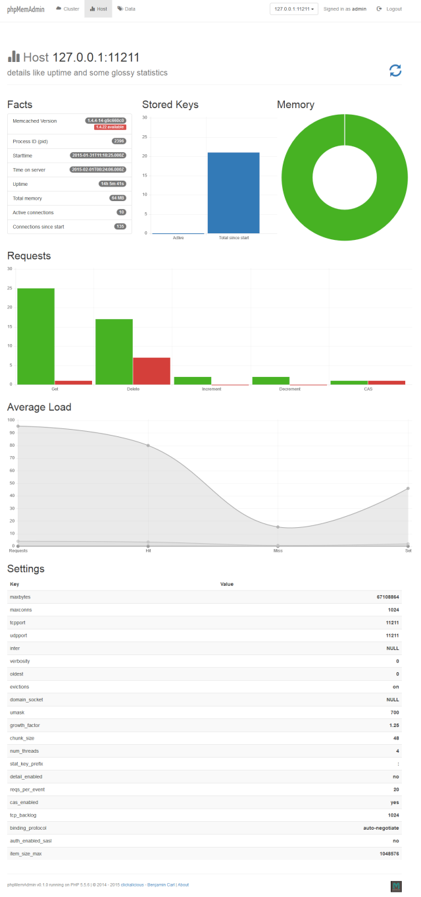
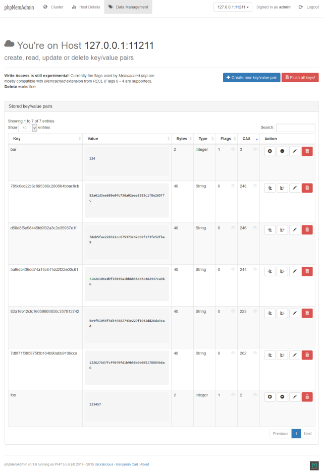

---
# phpMemAdmin


Bringing `Memcached` to the web


| [](https://travis-ci.org/clickalicious/phpMemAdmin) 	| [](https://scrutinizer-ci.com/g/clickalicious/phpMemAdmin/) 	| [](https://www.clickalicious.de/) 	| [](http://opensource.org/licenses/BSD-3-Clause) 	|
|---	|---	|---	|---	|
| [](https://github.com/clickalicious/phpMemAdmin/issues) 	| [](https://coveralls.io/r/clickalicious/phpMemAdmin)  	| [](https://github.com/clickalicious/phpMemAdmin/releases) 	| [](https://github.com/clickalicious/phpMemAdmin/stargazers)  	|

## Features

 - Detailed statistics, charts & graphs
 - Data management for `Memcached` (full CRUD support)
 - `Memcached` cluster health dashboard
 - `Memcached` host dashboard
 - Update check
 - Nice & comfortable UI
 - Clean & well documented code
 - Responsive and mobile ready


## Notice
This software is currently in early alpha state and so i want to warn - There is currently no ciritcal bug i know about but maybe still some potential for (Memcached) data loss - from my point of view its not critical in development cause it's a non-persistent memory store we're talkin about - but it's just fair to warn you before you use it! :)


## Requirements

 - PHP >= 5.3 (compatible up to version 5.6 - but **not compatible** with *hhvm*)


## Philosophy

`phpMemAdmin` was designed as helper while developing a cache in PHP using Memcached as in memory store. I had a need for a tool which displays me modified data stored in Memcached for example. The existing tools did not provide a UI i would describe as usable so i wrote my own. Trying to align it with the `PECL` Memcached extension.

## Installation
The recommended way to install this tool is through [Composer](http://getcomposer.org/). Require the `clickalicious/phpmemadmin` package into your `composer.json` file:

```json
{
    "require": {
        "clickalicious/phpmemadmin": "~0.3"
    },
    "scripts": {
    	"post-install-cmd": [
        	"Clickalicious\\PhpMemAdmin\\Installer::postInstall"
    	]
    }
}
```

**Important!** The postInstall call is important - it installs all required files and shows you an example vhost configuration for your installation. So be sure to add it to the `composer.json` (as shown above) before you call `composer install`. phpMemAdmin requires at least v0.4.0 of Memcached.php!

**phpMemAdmin** is also available as [download from github packed as zip-file](https://github.com/clickalicious/phpMemAdmin/archive/master.zip "zip package containing library for download") or via `git clone https://github.com/clickalicious/phpMemAdmin.git .`

### Config
After install is completed you will find a configuration file called `.config.dist` in the directory 'app/'. Rename this file to `.config` to enable you local configuration. The configuration is a simple JSON-structure which is self explaining. Example (.config.dist):

```json
{
  "username": "admin",
  "password": "pass",
  "timeout": -1,
  "cluster": {
    "name": "Cluster",
    "thresholds": {
        "notice": 50,
        "warning": 75,
        "error": 95
    },
    "hosts": [
      {
        "host": "127.0.0.1",
        "port": 11211
      }
    ]
  },
  "render": {
    "auto": true
  },
  "format": {
    "date": "Y-m-dTH:i:s"
  },
  "updatecheck": false
}

```

As you can see - you can add hosts of your cluster to `hosts` node in the tree. To enable `updatecheck` set it to true. Of course be sure to change `username` and `password`!

## Screenshots

| Cluster Dashboard |
|:---:|
|  |


----------


| Host Dashboard |
|:---:|
|  |


----------


| Data Management |
|:---:|
|  |


## Documentation

There is currently no documentation.


## Versioning
For a consistent versioning i decided to make use of `Semantic Versioning 2.0.0` http://semver.org. Its easy to understand, very common and known from many other software projects.


## Roadmap

- [ ] General stability improvements and tests
- [ ] Realtime statistics
- [ ] Move all assets from CDN to local filesystem as precondition for compiling everything into a single file app (requires an issue).
- [ ] Move "settings" from dashboard to an own page
- [ ] Add more checks to cluster health check
- [ ] Add Slab Statistics and Overview page


## Participate & share

... yeah. If you're a code monkey too - maybe we can build a force ;) If you would like to participate in either **Code**, **Comments**, **Documentation**, **Wiki**, **Bug-Reports**, **Unit-Tests**, **Bug-Fixes**, **Feedback** and/or **Critic** then please let me know as well!
<a href="https://twitter.com/intent/tweet?hashtags=&original_referer=http%3A%2F%2Fgithub.com%2F&text=%23phpMemAdmin%20-%20Bringing%20%40memcached%20to%20the%20web.%20https%3A%2F%2Fgithub.com%2Fclickalicious%2FphpMemAdmin&tw_p=tweetbutton" target="_blank">
  </img>
</a>


## Known Limitations
`phpMemAdmin` sometimes has trouble reading data written by `PHP Memcache` and/or `PHP Memcached` (note the d at the end) extension. So if you try to read data written by any of these extensions and get in trouble try to reset the store to clean state and try to manage data with `phpMemAdmin`. I still work on those compatibility issues trying to fix them to provide a maximum of compatibility and stability as well.  


## Author

| [](http://www.clickalicious.de) |
|---|
| [Benjamin Carl](http://www.clickalicious.de) |

## Sponsors  
Thanks to our sponsors and supporters:  

| JetBrains | Navicat |
|---|---|
| <a href="https://www.jetbrains.com/phpstorm/" title="PHP IDE :: JetBrains PhpStorm" target="_blank"></img></a> | <a href="http://www.navicat.com/" title="Navicat GUI - DB GUI-Admin-Tool for MySQL, MariaDB, SQL Server, SQLite, Oracle & PostgreSQL" target="_blank"></a>  |
